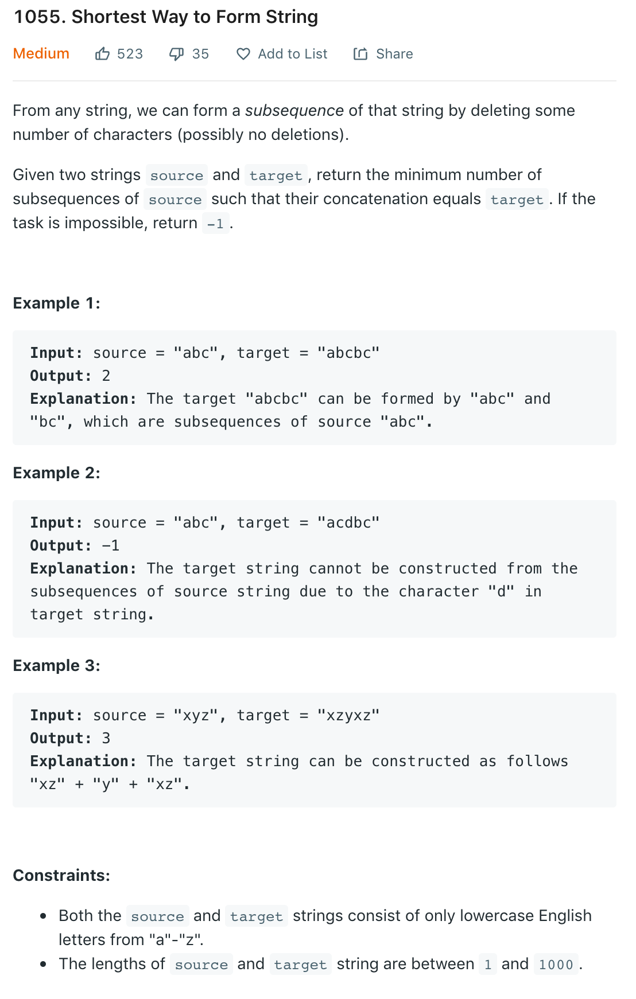
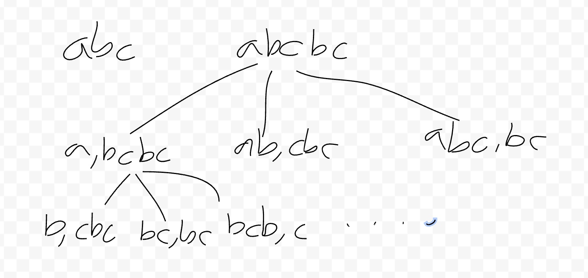

# 1055. Shortest Way to Form String

DP 남용하다 DP로 망한다! ㅠㅠ

## Problem

## Brute Force without memorization
- 기본 개념

- 문자열을 쪼개면서 앞에것이 subsequence 인지 확인하고 뒷 문자열은 Recursive 로 넘기는게 기본 아이디어
- Recursive 루틴에서 전체 타겟 문자열이 subsequence 면 1을 리턴.
  - 아니면 문자열을 두개로 쪼개면서 앞에 문자열이 subsequece 이면 뒷문자열의 Recursive 결과 값 중 적은것을 +1 을 하여 리턴
- 문자열이 subsequence 인지 아닌지를 확인하는 루틴 별도 작성
- 결론은 *Timeout*

## DP
- 기본 개념은 상기와 동일
- dp 어레이를 만들고 각 포지션 위치 뒤에서 가지는 subsequence 문자열 갯수를 저장하는 아이디어
- 포지션 위치에 대한 dp 값이 있으면 그걸 리턴
- 전체 타겟 문자열이 subsequence 이면 dp 에 1을 저장하고 1을 리턴
- 문자열을 두개로 쪼개면서 첫번째 문자열이 subsequence 이면 두번째 문자열 확인
  - 두번째 문자열 첫번째 포지션에 dp 가 설정되었으면 그걸로 최소값과 비교
  - 두번째 문자열 첫번째 포지션에 dp 가 설정되지 않은 경우 Recursive 를 돌려 결과를 최소갑과 비교
- 최종적으로 최소값을 +1 하여 리턴. 다만, 최소값이 최대값을 가지면 그냥 리턴
- 결론은 *하위 5%*

## Simple Brute Force
- 그냥 target 문자열을 source 문자열의 subsequence 인지 체크하고 카운트 처리
- 결론은 *66%*

## 교훈
- DP 남발하지 말고 쉽게도 풀어보자.

