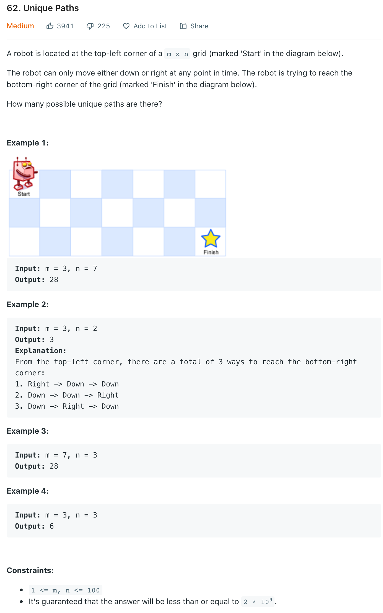
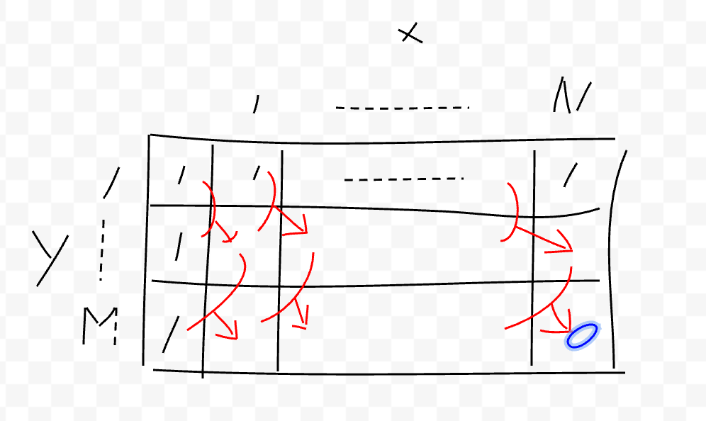

# [62 Unique Paths](https://leetcode.com/problems/unique-paths/)

## Problem


## Basic idea
- dfs 를 이용한 dp
  - 각각의 경우에 수에 따라 목적지에 도착하는 경우의 수를 dfs 로 처리
  - 중복 도착의 경우에 수를 재계산하는 것을 막기 위해 memorize 를 이용

- 좀 더 간단한 dp

  - y 가 0 인 축으로의 이동은 무조건 1, 그리고 x 가 0 인 축으로의 이동도 무조건 1
  - 예를 들어 x 가 0 인 축을 기준으로 삼는다면, 
    - (1, 1) 좌표는 (0, 0) 좌표의 경우의 수와 (0, 1) 좌표의 합산
    - (1, m) 좌표는 (1, m-1) 좌표의 경우의 수와 (0, m) 좌표의 합산
    - ...
    - (n, 1) 좌표는 (n-1, 0) 좌표의 경우의 수와 (n-1, 1) 좌표의 합산
    - (n, m) 좌표는 (n, m-1) 좌표의 경우의 수와 (n-1, m) 좌표의 합산
    - (n, m) 좌표의 값이 최종 경우의 수

## Code
```java
class Solution {
    public int dfs(int x, int y, int[][] dp) {
        if(x == dp[0].length-1 && y == dp.length-1) {
            return 1;
        }
        if(dp[y][x] > 0)
            return dp[y][x];
        
        int down = (y+1 < dp.length)? dfs(x, y+1, dp): 0;
        int right = (x+1 < dp[0].length)? dfs(x+1, y, dp): 0;
        dp[y][x] = (down+right) > 2000000000 ? 2000000000: down+right;
        return dp[y][x];
    }

    public int simple(int m, int n) {
        int[] arr = new int[m];
        for (int y = 0; y < m; y++) {
            arr[y] = 1;
        }
        for (int x = 1; x < n; x++) {
            for (int y = 1; y < m; y++) {
                arr[y] = arr[y] + arr[y-1];
            }
        }
        return arr[m-1];
    }
    
    public int uniquePaths(int m, int n) {
        //return dfs(0, 0, new int[m][n]);
        return simple(m, n);
    }
}
```

## References
- [Ricky Cho's Youtube Korean](https://www.youtube.com/watch?v=BsADUuqMABU)
- [Ricky Cho's Youtube English](https://www.youtube.com/watch?v=OL8xlEyqMJE)
