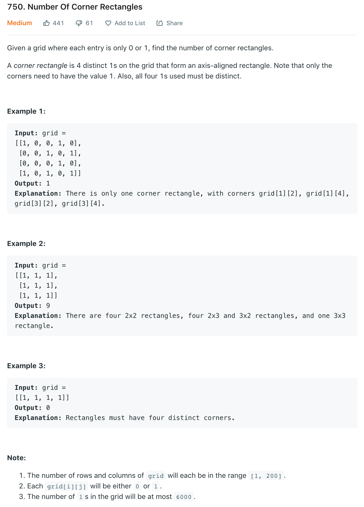
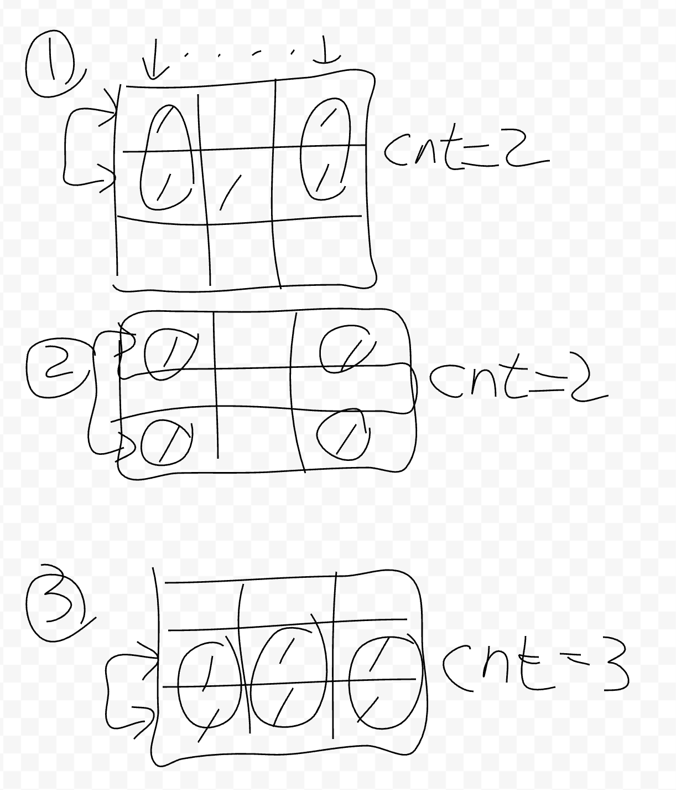
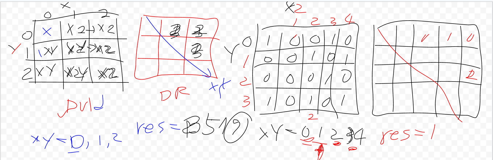

# 750. Number of corner rectangles

## Problem

## Solution

### Brute force

- 사각형을 확인하기 위해 2개의 y1=0, y2=y1+1 좌표 선택
- x 좌표를 이동하면서 두개의 좌표에 모두 1이 있는 것의 카운트 갯수를 구함
- 카운트된 갯수는 (count * (count -1))/2 계산으로 값을 변환
  - 해당 연산은 사각형의 벽면 갯수를 기준으로 조합가능한 사각형 갯수를 계산
  - 하나의 사각형의 두개의 양쪽 벽면을 가짐 : (2 * (2 - 1)) / 2 = 1
  - 두개의 사각형은 3개의 벽면을 가짐 : (3 * (3 - 1)) / 2 = 3
  - 세개의 사각형은 4개의 벽면을 가짐 : (4 * (4 - 1)) / 2 = 6 ...
- y2 를 증가하여 다시 두개의 좌표에 모두 1이 있는 갯수를 구함 (y2가 y의 최대까지)
- y1 을 증가하고, y2 = y1+1 로 좌표 선택하여 x 를 이동하며 갯수 구함 ...
- 모두 계산된 카운트 값을 합하면 정답

### DP
아몰랑~!

- 좌표와 dp 간 맵핑.. 모르겠음.
