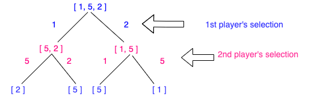

# Problem

[486. Predict the Winner](https://leetcode.com/problems/predict-the-winner/)

주어진 non-negative 정수로 이루어진 score array 에서,
Player 1 과 Player 2 가 양쪽 끝에서 score 를 하나씩 선택한다.
Player 1 이 먼저 선택하고 Player 2가 그 다음 선택하게 되며 모든 score 가 선택될 때 까지 반복한다.
Player 1 과 Player 2가 선택한 Score의 합을 기준으로 Winner를 결정한다.

주어진 Score array로 Player 1 이 Winner 가 되는지 Predict 하다.
( You can assume each player plays to maximize his score )

Constraints:

1 <= length of the array <= 20.
Any scores in the given array are non-negative integers and will not exceed 10,000,000.
If the scores of both players are equal, then player 1 is still the winner.

# Idea

DP[i][j] 는 Player 1의 chance 일 경우 i 와 j  사이의 Score만 남았을 경우 최대 Value.
만약 Player 1이 nums[i] 의 number를 선택하면, Player 2는 nums[i+1 or j] 의 number를 선택할 것이다.
만약 Player 1이 nums[j] 의 number를 선택하면, Player 2는 nums[i or j-1] 의 number를 선택할 것이다.
이를 General case 로 보면 이렇게 표현할수 있다.
    DP[i][j] = max(nums[i]+dp[i+1][j], nums[j]+dp[i][j-1])
하지만 DP[i+1][j] 과 DP[i][j-1]는 Player2가 선택의 선택에 따라 값이 달라진다.
이에 Player 2가 maximum score를 선택하는 경우를 추가해야 한다.


```
Player1이 i or j 를 선택하는 경우:
    Case 1: Player 1이 nums[i]를 선택, Player 2는 nums[i+1 or j]를 선택 가능
            a. Player 2가 nums[i+1] 를 선택, Player 1은 nums[i+2 or j] 를 선택 가능
            b. Player 2가 nums[j] 를 선택, Player 1은 nums[i+1 or j-1] 를 선택 가능
            Player 2 가 maximum score를 위해 선택할 것임으로, Player1은 nums[i]+min(1.a,1.b) 를 가지게 됨

    Case 2: Player 1이 nums[j]를 선택, Player 2는 nums[i or j-1]를 선택 가능
            a. Player 2가 nums[i] 를 선택, Player 1은 nums[i+1 or j-1] 를 선택 가능
            b. Player 2가 nums[j-1] 를 선택, Player 1은 nums[i or j-2] 를 선택 가능
            Player 2 가 maximum score를 위해 선택할 것임으로, Player1은 nums[j]+min(2.a,2.b) 를 가지게 됨

    Player 이 score를 최대로 가지기 위해서는 아래와 같음
        max(nums[i] + min(1.a, 1.b), nums[j] + min(2.a, 2.b));

    DP[i][j] = max( min (dp[i + 1][j - 1], dp[i + 2][ j]) + v[i], min (dp[i][j - 2], dp[i + 1][ j - 1]) + v[j]})
````

# Implementation

* [c++11 TopDown](PredicttheWinner_TopDown.cpp)
```
    bool PredictTheWinner(vector<int>& nums) {
        int n = nums.size();
        int result = 0;
        // get total sum
        int total = 0;
        for(auto x: nums)
            total += x;

        vector<vector<int>> dp (n, vector<int>(n, -1));

        result = helper(nums, dp, 0, n-1);
        return (result >= total-result);
    }
    int helper(vector<int>& nums, vector<vector<int>>& dp, int i, int j) {
        if(i>j)
            return 0;
        if(dp[i][j]!=-1)
            return dp[i][j];
        dp[i][j] = max((nums[i]+min(helper(nums, dp, i+2, j), helper(nums, dp, i+1, j-1))),
                        (nums[j]+min(helper(nums, dp, i+1, j-1), helper(nums, dp, i, j-2))));
        return dp[i][j];
    }
```
* [c++11 BottomUp](PredicttheWinner_BottomUp.cpp)

```
    bool PredictTheWinner(vector<int>& nums) {
        int n = nums.size();
        int result = 0;
        // get total sum
        int total = 0;
        for(auto x: nums)
            total += x;
        vector<vector<int>> dp (n, vector<int>(n, 0));

        for(int len = 1; len<=n; len++) {
            for(int i =0; i<=n-len; i++) {
                int j = i+len-1;

                int a = (i+1<n && j-1>=0)?dp[i+1][j-1]:0;
                int b = (i+2<n)?dp[i+2][j]:0;
                int c = (j-2>=0)?dp[i][j-2]:0;

                dp[i][j] = max(nums[i]+min(a,b), nums[j]+min(a,c));
            }
        }

        result = dp[0][n-1];
        return (result >= total-result);
    }

```

# Complexity

```
    Time Complexity - O(N^2)
    Space Complexity - O(N^2)
```

# Reference: 
Reference: MIT 10. Dynamic Programming: Advanced DP
           https://www.youtube.com/watch?v=Tw1k46ywN6E&feature=youtu.be&t=3295


