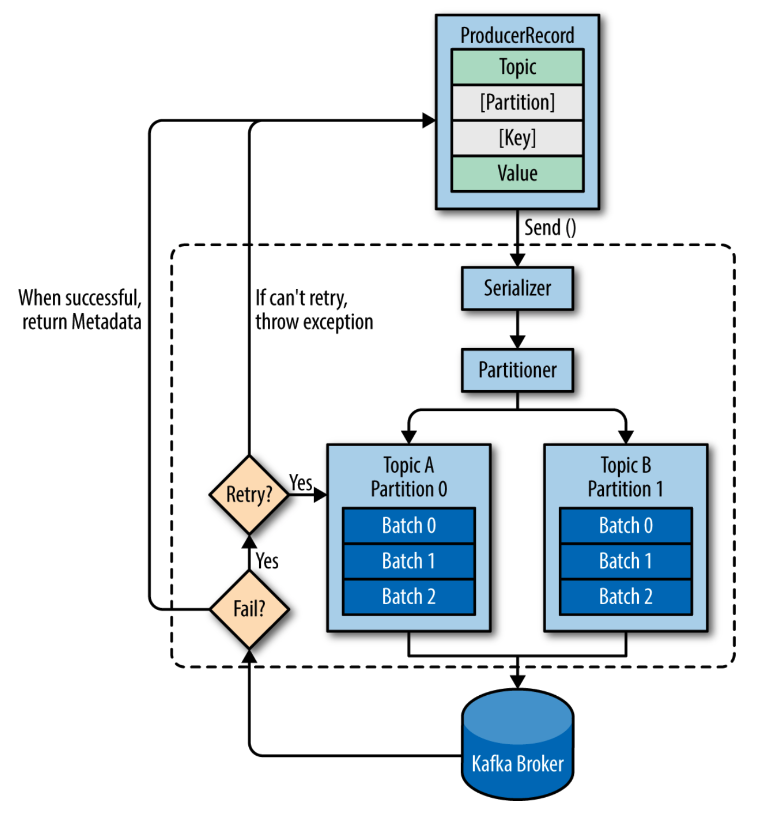

# Apache Kafka

## What is the Kafka
- Developed by LinkedIn
- Distributed messaging service system

## What is the Message queue system
- Asynchronous message queue system on distribution system environment
- Publish/Subscribe model
- AMQP(Advanced Message Queuing Protocol) standard : open standard applicaition layer protocol for message-oriented middleware
  - Producers -> ( Exchange -> Binding -> Queue ) -> Consumer
  - Bindings : Direct exchange, Fanout exchange, Topic exchange, Header exchange
    - Direct exchange

    - Topic exchange

- Kafka, RabbitMQ, ActiveMQ (Amazon), ZeroMQ, Amazon SQS ....

## Special things 
- Multi producer, multi consumer (?)
- Topic -> partition : pararelle process, can't quarantee squencial processing on consumer
  - Partition

  - Consumer group

- Not support AMQP
- Store message to filesystem.
- High throughput than others
- Message pull from broker
- Un-distrupted scale out support

## System architecture
- Publisher(Producer) -(message)-> ( Broker -> Topic -> Partition ) <-(pull)- Subscriber(Consumer, Consumer Group)
                            +----> ( Broker +        +> Partition ) <---+

## Check point
- Message processing order : not quarntee with multi partition
- Partition count : performance vs resource
...

## Usage
- Uber

