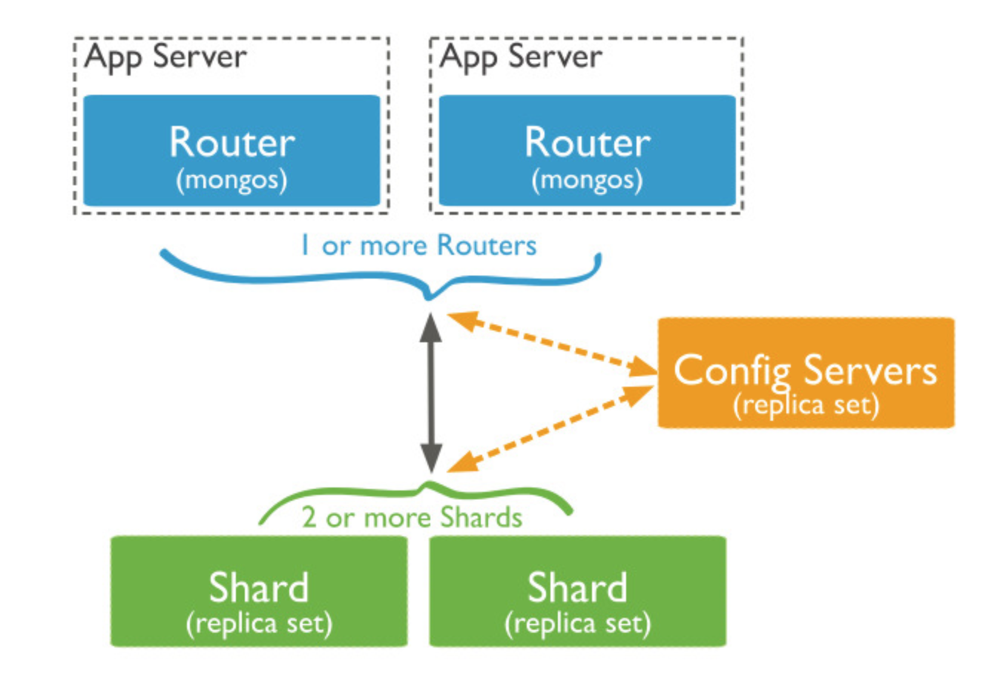

# MongoDB

## What is the MongoDB
- Open source software
- NoSQL database
- Document(JSON)-based database
- Ad hoc queries (Field, Range, Regular express), indexing, and realtime aggregation support
- GRO-based, Graph, and Text search 
- Replication & High Availability
- Auto-sharding

# Logical Data Architecture
- Database : Database
- Collection : Table
- Document : Row
- Field : Column
- Object_ID field : Primary key
- Embeded & Link : Relationship

# System Architecture
- Master-slave
	- Backup purpose
	- No auto-failover ???
- Replica set : Primaray-secondary
	- Replication add/mod data to secondary using oplog
	- Hearbeat check among primary and secondary using Arbiter
	- Election for new primary when fault occurred on primary
	- Casual consistency on client session (https://docs.mongodb.com/manual/core/read-isolation-consistency-recency/)

- Sharding
	- Shards, MongoS, Config servers
    - Shard using Shard key. Key can't exceed 512byte
    - Hashed sharding, Chunk, Zone
    - Sharded cluster balancer 

